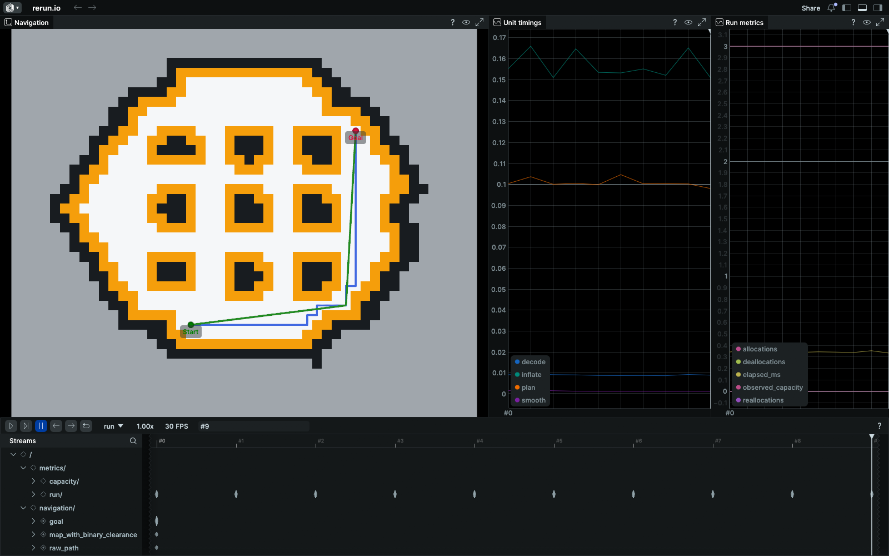

# UnitCompose


## From monolithic algorithms to composable systems

**UnitCompose** is an embeddable Rust framework for building performance-critical algorithms from typed, testable, and replaceable **Units**.

Connect Units through named **Resources**, compose them into configuration-driven DAGs, and prepare storage before execution. Algorithm teams can evolve implementations and compositions independently, while host applications retain control of lifecycle, communication, threading, and deployment. The same binary can load different algorithm compositions without rewriting the host or hard-coding the graph in source code.

UnitCompose is built on lessons from 1,000 days of engineering across 10+ algorithm teams, 1,000+ engineers, and software shipped at million-product scale. It is designed for autonomous driving and embedded intelligence, and for any system that needs predictable performance without sacrificing a decoupled development experience.

UnitCompose targets the layer *inside* a larger component. A ROS node, service, simulator, offline tool, or another framework owns the Module and decides when to build, run, replace, and destroy it. UnitCompose does not take over the application lifecycle or communication system.

## Inspection at a glance

<table>
  <tr>
    <th>Prepared Module</th>
    <th>Measured over 1,000 runs</th>
  </tr>
  <tr>
    <td><a href="docs/assets/navigation-module.svg"></a></td>
    <td><a href="docs/assets/navigation-module-timed.svg"></a></td>
  </tr>
  <tr>
    <th colspan="2">Interactive navigation episode</th>
  </tr>
  <tr>
    <td colspan="2"><a href="https://app.rerun.io/version/0.24.1/?url=https%3A%2F%2Fraw.githubusercontent.com%2FMiaoDX%2Funit-compose%2Fmain%2Fdocs%2Fassets%2Fnavigation-astar.rrd"></a></td>
  </tr>
</table>

[View the latest CI-generated reports for all three demos](https://miaodx.github.io/unit-compose/demos/).
Each successful `main` build publishes fresh Module graphs, measured timings,
run metrics, and interactive Rerun recordings. Pull requests retain the same
report as a downloadable GitHub Actions artifact.

The fixed graph is available before execution; the measured view annotates the
same graph with average and nearest-rank p99 wall-clock duration. Timing values
are a representative snapshot and vary by machine. Click the Rerun preview to
open the recorded 1,000-leg episode in the version-matched Web Viewer, where
playback starts automatically using the recording's fixed blueprint. The
committed [`navigation-astar.rrd`](docs/assets/navigation-astar.rrd) can also be
opened locally with a compatible Rerun 0.24.1 viewer.

## Core model

UnitCompose keeps the public model intentionally small:

- **Unit** — one independently understandable and testable computation step with declared input and output ports;
- **Resource** — one named, typed logical value produced by a Module input or Unit output and consumed read-only by zero or more Units;
- **Module** — one validated and prepared Resource DAG owned by a host. Its compiled structure and storage plan are fixed, while Unit state, prepared storage contents, run state, and diagnostics evolve across runs.

Inspection, diagnostics, timing, storage reports, and optional Resource visualization are read-only Module capabilities rather than an additional domain object.

Registries, resolved definitions, compiled graphs, storage slots, pending output sets, workspace stacks, runtime state, and the sequential executor are implementation mechanisms rather than additional concepts that ordinary users must learn.

## Configuration-driven composition

The binary registers available Unit implementations. YAML selects which implementations to instantiate and how Resources connect them. V0 rejects YAML aliases and merge keys so duplicate-key checks, source paths, and normalization remain deterministic:

```yaml
schema: unit-compose/v0alpha1
module: navigation_planning

inputs:
  map_asset: { type: nav.RosMapAsset/v1 }
  request:   { type: nav.PlanRequest/v1 }

units:
  map_decoder:
    type: nav.ros_map_decoder/v1
    inputs:  { asset: map_asset }
    outputs: { grid: occupancy_grid }

  inflation:
    type: nav.binary_inflation/v1
    config: { robot_radius_m: 0.22 }
    inputs:  { grid: occupancy_grid }
    outputs: { costmap: navigation_costmap }

  planner:
    type: nav.astar/v1
    config: { diagonal_motion: true, max_expanded_nodes: 200000 }
    inputs:
      costmap: navigation_costmap
      request: request
    outputs: { plan: raw_plan }

  smoother:
    type: nav.line_of_sight_smoother/v1
    inputs:
      costmap: navigation_costmap
      plan: raw_plan
    outputs: { plan: final_plan }

outputs:
  plan: final_plan
```

Changing `nav.astar/v1` to `nav.dijkstra/v1` changes the algorithm without changing host code or Resource bindings. Removing the smoother and exporting `raw_plan` changes the DAG itself.

## Prepared storage

Resource identity is separate from physical storage. A Resource type descriptor defines representation invariants such as the concrete Rust type and storage adapter. A Unit requirement function determines only the size or capacity needed for each output from validated configuration and input bounds.

Module construction then:

1. validates and normalizes the definition;
2. resolves Unit and Resource descriptors into an implementation-neutral resolved Module;
3. computes stable execution order and Resource live ranges;
4. plans compatible output slots and Unit workspaces;
5. allocates storage, constructs Unit instances, and optionally warms up the prepared Module.

During one run, each Resource value is write-once: it becomes read-only after successful publication and remains so for the rest of that run. A later run resets run-local state and writes a new value for the same logical Resource.

A Unit writes into framework-provided pending outputs and scratch space. The framework validates the Unit's complete output set and publishes it as one group. Failed or incomplete pending outputs are discarded safely.

The default managed mode prioritizes a friendly development path. An opt-in strict profile requires fixed or bounded capacities and no dynamic allocator operations in every declared allocation domain during steady-state runs. Instrumented domains are verified; domains that cannot be instrumented require an inspectable trusted certification. The guarantee depends on complete and correct declarations.

## V0 behavior

V0 establishes the following baseline:

- every required Unit input binds to exactly one Resource;
- every Resource has exactly one producer and may have multiple read-only consumers;
- semantic Resource types, concrete runtime representations, port contracts, configuration, bounds, cycles, and duplicate producers are validated before Unit business code runs;
- Units execute once in a stable topological order;
- a Unit publishes its complete output set only after successful output validation;
- output and scratch storage can be prepared by the framework rather than allocated inside `Unit::run`;
- compatible typed storage may be reused when Resource live ranges do not overlap;
- strict capacity overflow fails explicitly instead of growing a buffer;
- Unit private state may persist across runs, but the framework does not roll it back;
- an unwind panic drops pending outputs and fatally poisons the Module, while `panic=abort` has no cleanup or poisoning guarantee;
- `run_into` publishes complete logical outputs but does not roll back partially mutated caller storage after failure;
- host-owned configuration reload builds and prepares a new Module, activates it between runs, and retains borrowed old Module storage as long as needed;
- Module inspection and run reports can describe the DAG, execution order, storage plan, timing, failures, and selected Resource values.

## Intentionally deferred

V0 does not guarantee transactional commit or rollback, framework-managed persistent Resources, automatic parallel or asynchronous execution, dynamic native plugins, Python Unit authoring, generalized cross-language zero-copy leases, GPU memory planning, cross-type optimal memory packing, checkpointing, distributed execution, or in-place DAG mutation.

## Documentation

Start with:

- [Documentation index](docs/README.md)
- [Concept overview](docs/concepts/overview.md)
- [Terminology](docs/concepts/terminology.md)
- [ADR-0002: Configuration-driven Resource DAG](docs/adr/0002-configuration-driven-resource-dag.md)
- [ADR-0003: Framework-managed Resource storage](docs/adr/0003-framework-managed-resource-storage.md)
- [V0 architecture specification](docs/specification/v0-architecture.md)
- [V0 implementation plan](docs/plans/v0-implementation-plan.md)

## Run the V0 Quickstart

The workspace is an integrated, non-publishing Rust project with MSRV 1.89.
From the repository root, run any of the three strict navigation compositions:

```bash
cargo run -p navigation-planning --locked -- --module examples/navigation-planning/astar.yaml --strict
cargo run -p navigation-planning --locked -- --module examples/navigation-planning/dijkstra.yaml --strict
cargo run -p navigation-planning --locked -- --module examples/navigation-planning/astar-no-smoothing.yaml --strict
```

Inspect the same prepared Module without executing its algorithm:

```bash
cargo run -p navigation-planning --locked -- --module examples/navigation-planning/astar.yaml --inspect text
cargo run -p navigation-planning --locked -- --module examples/navigation-planning/astar.yaml --inspect dot
cargo run -p navigation-planning --locked -- --module examples/navigation-planning/astar.yaml --inspect mermaid
cargo run -p navigation-planning --locked -- --module examples/navigation-planning/astar.yaml --timed-mermaid
```

Record the same strict run as a Rerun file without opening a viewer, or stream
it to an external viewer. Rerun is a default-off example feature and all
serialization happens after the measured run:

```bash
cargo run -p navigation-planning --features rerun --locked -- --module examples/navigation-planning/astar.yaml --rerun-save navigation-astar.rrd
cargo run -p navigation-planning --features rerun --locked -- --module examples/navigation-planning/astar.yaml --rerun-spawn
```

The Rerun routes record one deterministic 1,000-leg navigation episode. The map
is timeless, while stable current-route entities, robot pose, a bounded
64-sample pose trail, Unit timings, and run metrics advance together on the
`episode_tick` timeline.

The 48 x 40 demo fixture is a fixed downsample of the Apache-2.0
[TurtleBot3 Navigation2 map](https://github.com/ROBOTIS-GIT/turtlebot3/blob/fc817ce3073af1d6032397c64504134882af5e9a/turtlebot3_navigation2/map/map.pgm).
The recording renders free, occupied, and unknown ROS cells plus an amber
binary clearance mask. The mask is deliberately not a graded Nav2 cost field.
It also includes the raw path, start and goal markers, the smoothed path when
configured, per-Unit timing series, run/capacity metrics, and a fixed viewer
blueprint. Mermaid is the canonical fixed graph view; `--timed-mermaid` joins
that graph with the same 1,000 completed episode legs and annotates each Unit
with average, nearest-rank p99 wall-clock duration, and `n=1000`. The spawn
route requires a compatible `rerun` executable on `PATH`.

The two planner definitions compare A* and Dijkstra on the same four-neighbor,
unit-cost grid. A* uses an admissible Manhattan heuristic and is the preferred
point-to-point implementation because it usually expands fewer cells; Dijkstra
is retained as the simple optimality/reference baseline. They produce the same
shortest path under the current binary cost semantics. JPS is the most relevant
next benchmark for larger uniform grids, while Theta* is the most relevant path
quality comparison because it can incorporate line-of-sight shortcuts directly.

The adapter currently pins the coupled Rerun SDK crates to `0.24.1`. The latest
stable SDK family is newer, but upgrading requires a coordinated API migration
and regenerating recordings with a matching viewer; it is intentionally tracked
as a separate dependency slice rather than mixed into the v0 visualization
change.

## Run the registration showcases

Fetch the verified OpenCV and Open3D inputs, then run either best-effort Kornia
pipeline headlessly:

```bash
scripts/fetch-showcase-data.sh
cargo run -p image-registration --locked -- --module examples/image-registration/image-registration.yaml --run
cargo run -p point-cloud-registration --locked -- --module examples/point-cloud-registration/point-cloud-registration.yaml --run
```

Both examples also support `--inspect mermaid`, `--timed-mermaid`, and
default-off Rerun save/spawn routes. See the
[registration showcase guide](docs/implementation/registration-showcases.md)
for exact commands, dataset provenance and checksums, expected metric ranges,
and recorded entities. The
[live CI report](https://miaodx.github.io/unit-compose/demos/) runs these two
pipelines alongside navigation on every build and publishes the latest
successful `main` result.

See [Milestone 7 hardening evidence](docs/implementation/milestone-7-hardening.md)
for the supported target matrix, benchmark observations, and release-readiness
verification commands.

## License

This project is licensed under the [MIT License](LICENSE).
