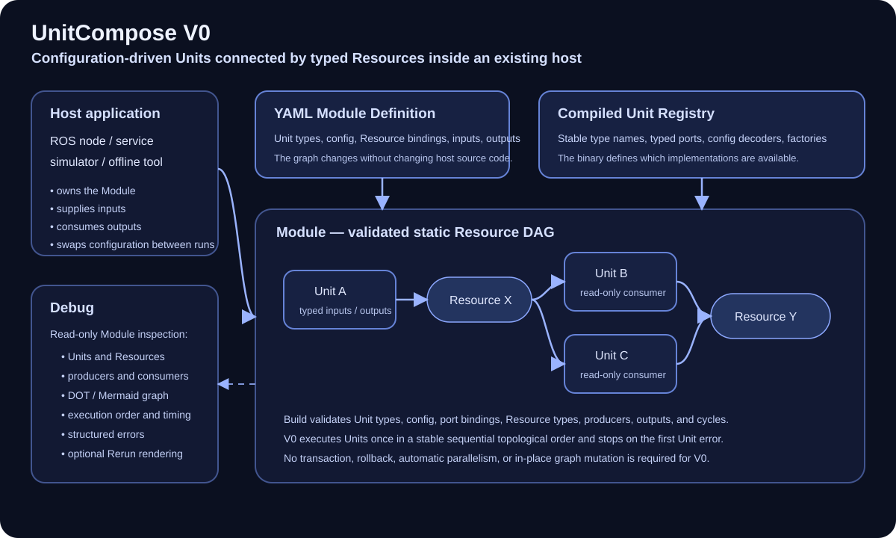

# UnitCompose



**UnitCompose** is an embeddable framework for organizing stateful computation into explicit **Units**, **Resources**, and validated **Plans**.

Algorithm modules often begin as a single entry point and gradually accumulate implicit dependencies, shared mutable state, initialization branches, profiling hooks, and execution-order assumptions. The resulting code can still work, but it becomes difficult to test, inspect, parallelize, or reuse.

UnitCompose targets that narrower problem: helping algorithm engineers and application developers build clean, modular components inside a larger host system such as a ROS process, a service, a simulator, or another framework.

## Design direction

UnitCompose does not start from a new scheduling theory. Its design combines ideas that have been explored for years across several communities:

- explicit resource access and conflict analysis from ECS frameworks;
- explicit dependencies and readiness-based execution from dataflow systems;
- revision and state separation from incremental computation;
- deterministic concurrency from reactive coordination models;
- commit boundaries and effect isolation from workflow and stream-processing systems.

The goal is not to reproduce any one of those systems. It is to adapt a small, coherent subset of their ideas to in-process, stateful algorithm modules.

## Architecture at a glance

The architecture diagram above summarizes the intended review model:

- a **host application** embeds one or more **Modules**;
- a **Plan** defines Units, Resources, bindings, and execution constraints;
- a **Scheduler** executes Units according to the Plan;
- **Resources** carry inputs, intermediate values, persistent state, and exports;
- a **Run** either commits all framework-controlled results atomically or fails without commit.

The SVG is intentionally simple and review-oriented. It is meant to make the core model easy to discuss before we commit to implementation details.

## Core model

A **Module** runs a validated **Plan**. The Plan contains **Units** and **Resources**. Each Unit declares which Resources it observes, creates, or updates.

```text
Host application
    |
    v
Module
  |- Unit: preprocess
  |- Unit: detect
  |- Unit: track
  |
  `- Resources: input, intermediate values, persistent state, exports
```

Illustrative definition:

```yaml
resources:
  raw_points:        { type: PointCloud, lifetime: external }
  normalized_points: { type: PointCloud, lifetime: run }
  objects:           { type: Objects, lifetime: run, export: true }
  tracks:            { type: Tracks, lifetime: persistent, export: true }

units:
  - id: preprocess
    type: Preprocessor
    bind:
      points: raw_points
      normalized: normalized_points

  - id: detector
    type: Detector
    bind:
      points: normalized_points
      objects: objects

  - id: tracker
    type: Tracker
    bind:
      objects: objects
      tracks: tracks
```

The Unit declarations define access intent:

```text
Unit Detector
  points:  Observe<PointCloud>
  objects: Create<Objects>
```

## What UnitCompose aims to provide

- explicit Unit and Resource contracts;
- validation before algorithm code runs;
- deterministic sequential reference execution;
- a path to safe parallel scheduling without changing Unit business logic;
- persistent state with defined commit and failure behavior;
- inspectable plans, dependencies, conflicts, copies, and timing;
- Rust-first implementation with a compatible Python authoring model;
- safe zero-copy where ownership, representation, and lifetime permit it.

## What UnitCompose is not

UnitCompose is not intended to be:

- an application framework or ROS replacement;
- a distributed workflow platform;
- a general-purpose ECS;
- a streaming analytics engine;
- a dynamic orchestration system;
- a promise of universal zero-copy.

## Status

The project is currently in the **design and Alpha planning** phase. The repository intentionally begins with the conceptual model, execution semantics, research landscape, and architecture decisions that will guide implementation.

Start with:

- [Documentation index](docs/README.md)
- [Concept overview](docs/concepts/overview.md)
- [Core design specification](docs/specification/core-design.md)
- [Alpha scope](docs/specification/alpha-scope.md)
- [Research landscape](docs/research/landscape.md)
- [Implementation options](docs/research/implementation-options.md)

## Community foundations

The most relevant references currently include [Bevy ECS](https://github.com/bevyengine/bevy), [Flecs](https://github.com/SanderMertens/flecs), [NVIDIA Holoscan](https://github.com/nvidia-holoscan/holoscan-sdk), [Salsa](https://github.com/salsa-rs/salsa), [Timely Dataflow](https://github.com/TimelyDataflow/timely-dataflow), [Differential Dataflow](https://github.com/TimelyDataflow/differential-dataflow), [Hydroflow](https://github.com/hydro-project/hydroflow), [Lingua Franca](https://github.com/lf-lang/lingua-franca), [Temporal](https://github.com/temporalio/temporal), and [Apache Flink](https://github.com/apache/flink).

Holoscan is particularly relevant as a production-oriented operator and execution framework in the NVIDIA ecosystem. Even though UnitCompose is narrower in scope and uses a different public model, Holoscan is a useful reference for how modular execution infrastructure can support real algorithm workloads, heterogeneous compute, and host integration.

These projects are references, not implied dependencies. Direct dependencies will be selected only after focused prototypes establish semantic fit and implementation cost.

## Contributing

The terminology and Alpha semantics are intentionally documented before implementation. Proposed changes to project positioning, core terminology, or observable execution behavior should be recorded as an Architecture Decision Record.

See [CONTRIBUTING.md](CONTRIBUTING.md).

## License

This project is licensed under the [MIT License](LICENSE).
